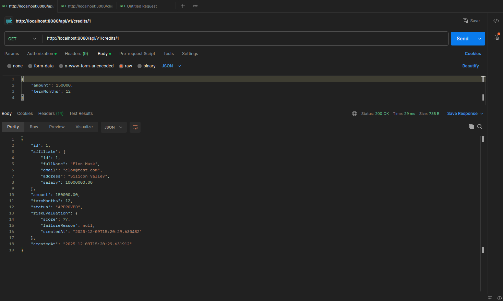

#### NOMBRE: Samuel Andrey Zapata Casas
#### CLAN: Lovelace
#### DOCUMETO: 1036519037
#### CORREO: samuelandrey1207@gmail.com

# 🏦 CoopCredit - Sistema Integral de Solicitudes de Crédito


## 📋 Project Description

CoopCredit is a modern, distributed software solution designed to automate and secure the loan application and evaluation process. The system implements a strict **Hexagonal Architecture (Ports and Adapters)** to ensure decoupling between business logic and technological infrastructure.

The ecosystem is composed of orchestrated microservices that handle everything from secure authentication to financial risk assessment through integration with external systems.

---

## 🏗️ Architecture and Design

The project rigorously follows the principles of **Clean Architecture**:

### 💠 Hexagonal Architecture
The application's core (`domain`) is framework and database agnostic.

* **Domain (Core):** Entities (`CreditApplication`, `User`), Business Exceptions, and Ports (Interfaces).
* **Application (Service Layer):** Implementation of use cases (`ManageCreditApplicationUseCase`) and orchestration.
* **Infrastructure (Adapters):**
* *Input:* REST controllers (`AuthController`, `CreditApplicationController`).
* *Output:* JPA repositories (`PostgreSQL`), external REST adapters (`RiskServiceAdapter`), and security (`JwtService`).
### 🧩 Microservices
1. **`credit-application-service` (Core):**
* User and member management.
* Credit application processing.
* Business rules (salary vs. quota validation).
* Security and authentication.
2. **`risk-central-mock-service` (Mock):**
* External credit bureau simulator.
* A deterministic hash-based algorithm to return consistent scores.
--
## 🛠️ Tecnologías y Métodos Empleados

| Categoría        | Tecnología / Librería | Uso en el Proyecto |
|:-----------------| :--- | :--- |
| **Lenguage**     | **Java 17 (OpenJDK)** | Backend development foundation. |
| **Framework**    | **Spring Boot 3.3.0** | Dependency injection, Web, Data. |
| **DataBase**     | **PostgreSQL 15** | Probust relational persistence. |
| **Migration**    | **Flyway** | Database version control (`V1__schema.sql`). |
| **Security**     | **Spring Security + JWT** | Stateless authentication and role-based authorization. |
| **Mapeo**        | **MapStruct** | Efficient conversion between Entities, Domains, and DTOs. |
| **HTTP Client** | **Spring RestClient** | Synchronous communication between microservices. |
| **Containers** | **Docker & Compose** | Reproducible orchestration and deployment.|
| **Testing**      | **JUnit 5 & Mockito** | Unit and integration testing.|
| **Librerías**    | **Lombok** | Reduction of repetitive code (Boilerplate). |

---

## 👥 User Roles and Flows

The system implements Role-Based Access Control (RBAC) security with the following roles:
### 1. 🟢 AFFILIATE ROLE (End User)
* **Registration:** You can register by creating a user account and financial profile simultaneously.
* **Apply for Credit:** You can create credit applications (if you are active and meet the financial requirements).
* **Restriction:** You can only view and manage your own data.
### 2. 🔵 ANALYST ROLE / ADMIN ROLE (Internal Staff)
* **Inquiries:** Access to view credit applications by ID for auditing or review.

### 🔄 Credit Application Flow (Main Use Case)
1. The **Affiliate** authenticates and obtains a JWT token.
2. Send a request (`POST /api/v1/credits`) with the amount and term.
3. **Business Validations:**
* Does the member exist and is active?
* **Financial Rule:** Does the estimated monthly payment exceed 50% of their monthly salary?

4. **Risk Assessment:** The system consults the `risk-central` microservice.
* If Score < 70 → REJECTED (Automatic).
* If Score >= 70 → APPROVED.
5. **Persistence:** The request and risk assessment are saved transactionally.
```
com.coopcredit.creditapplication
│
├── application
│   ├── dto                 <-- Data Transfer Objects (Request/Response)
│   ├── service             <-- Implementation of Input Ports (Use Cases)
│   └── mapper              <-- MapStruct Interfaces
│
├── domain
│   ├── model               <-- Pure Java Objects (No Annotations ideally, but we might be pragmatic)
│   ├── exception           <-- Domain Exceptions
│   └── ports
│       ├── input           <-- Use Case Interfaces (Service Interfaces)
│       └── output          <-- Repository Interfaces / External Service Ports
│
└── infrastructure
├── adapter
│   ├── input           <-- REST Controllers
│   └── output
│       ├── persistence <-- JPA Repositories & Entities
│       └── external    <-- RestClient for Risk Service
│
└── config              <-- Spring Configuration (Security, Beans)
```
---

## 🚀 Installation and Run Guide

### Prerequisites
* Docker Desktop (https://www.docker.com/products/docker-desktop/) installed and running.

* (Optional) Java 17 and Maven if you wish to run it locally without Docker.

### 👣 Step 1: Clone and Prepare
Download the project and navigate to the root folder `CoopCreditSolution`.

```bash
cd CoopCredit
```

### 👣 Step 2: Run with Docker (Recommended)

This command will compile the code, build the Docker images, and launch the entire ecosystem (Database, App, and Mock).

```bash
docker-compose up --build
```
Wait to see the message: Started CreditapplicationApplication in the logs.

## 🧪 How to Test the Program (Step by Step)

We will use **Postman** or any HTTP client.

### 1. Register (Gain Access)

Create a user with a sufficient salary to pass the business rules.

* **Method:** `POST`
* **URL:** `http://localhost:8080/auth/register`

**Body (JSON):**

```json
{
"username": "rich_user",
"password": "securePass123!",
"fullName": "Elon Musk",
"email": "elon@test.com",
"address": "Silicon Valley",
"salary": 10000000
}
```
Important: Copy the token from the response you receive. You will need it for the following steps.

### 2. Request a Loan

* **Method:** `POST`
* **URL:** `http://localhost:8080/api/v1/credits`
* **Headers:**
`Authorization: Bearer <PASTE_YOUR_TOKEN_HERE>`

**Body (JSON):**

```json
{
"amount": 150000,
"termMonths": 12
}
```

Expected Response (200 OK):
```json
{
"status": "APPROVED",
"amount": 150000,
"riskEvaluation": { "score": 85 }
}
```

### Rejection Test (Business Validation)

Attempt to request an unpayable loan.

**Body (JSON):**

```json
{ "amount": 100000000, "termMonths": 6 }
```
Expected Response (400 Bad Request):

```JSON
{ 
"title": "Business Rule Violation", 
"detail": "Loan rejected: Calculated monthly quota (...) exceeds 50% of your monthly income..."
}
```

```bash
mvn test
```


# POSTMAN:


