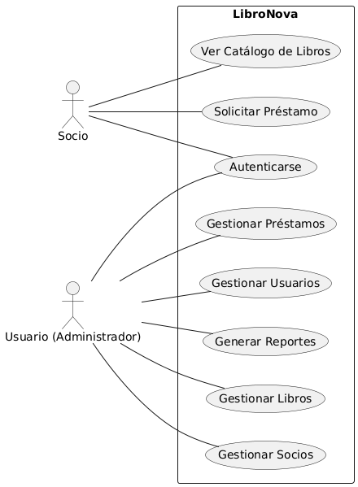
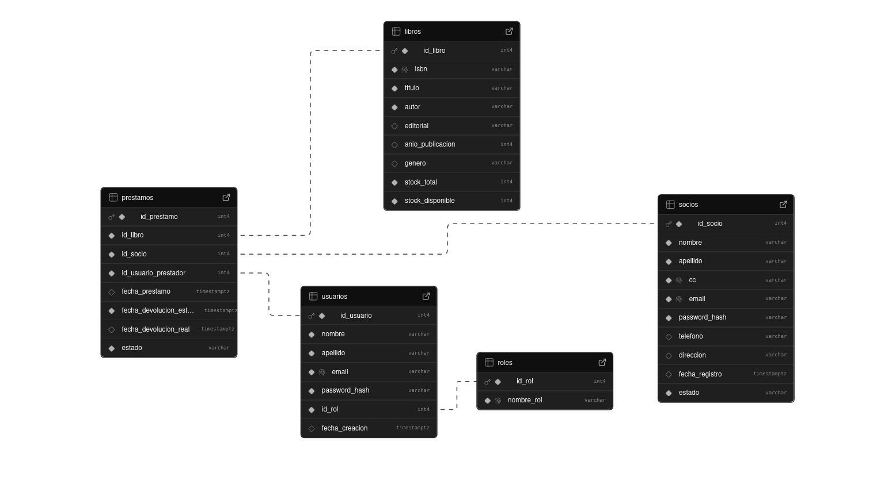

- NOMBRE: Samuel Andrey Zapata Casas
- CLAN: Lovelace
- CORREO: samuelandrey1207@gmail.com
- CC: 1036519037

# LibroNova - Library Management System

LibroNova is a desktop application developed in Java SE for managing a library's internal operations. It allows for the management of books, members (partners), users (employees), and loans, featuring role-based access control and business rule validations.

---

## Features

-   **User and Member Management:** Register and manage system users (administrators) and library members.
-   **Book Catalog:** Full CRUD (Create, Read, Update, Delete) operations for the book inventory.
-   **Loan System:** Transactional system for handling book loans and returns, ensuring data integrity.
-   **Role-Based Access:** Different menus and functionalities for administrators and members.
-   **CSV Reporting:** Export the complete book catalog and overdue loans to CSV files.
-   **Robust Architecture:** Built using a layered architecture for maintainability and scalability.

---

## Technologies Used

-   Java SE 17
-   Swing for the graphical user interface (JOptionPane)
-   JDBC for database connectivity
-   PostgreSQL (tested with Supabase)

---

## Project Architecture

The application is built upon a classic layered architecture, which separates concerns and makes the code easier to manage and extend.

-   **`controller`**: This layer is responsible for handling user input from the `JOptionPane` dialogs. It acts as the intermediary between the user and the application's business logic. It does not contain any business rules; it only delegates tasks to the service layer and displays the results.

-   **`service`**: The "brain" of the application. This layer contains all the business logic, rules, and validations (e.g., "a book cannot be loaned if stock is zero," "a member cannot be created if their ID already exists"). It orchestrates calls to one or more DAOs to fulfill a use case, often managing transactions.

-   **`dao` (Data Access Object)**: This layer is exclusively responsible for all communication with the database. It abstracts the SQL queries and JDBC logic. Each DAO corresponds to a single database entity (e.g., `LibroDao`, `SocioDao`).

-   **`model`**: Contains the POJOs (Plain Old Java Objects) that represent the application's entities (e.g., `Libro`, `Socio`). These objects are used to transfer data between layers.

-   **`util`**: A package for utility classes that provide shared functionalities across the application, such as database connection management (`DatabaseConnector`), logging (`LoggerUtil`), and property file loading (`PropertiesLoader`).

-   **`exception`**: Home to custom exceptions (`BusinessException`, `DataAccessException`) that allow for a structured and meaningful error handling flow between layers.

---

## Getting Started

Follow these steps to set up and run the project locally.

### 1. Prerequisites

-   Java JDK 17 or higher installed.
-   An IntelliJ IDEA (or other Java IDE) instance.
-   A PostgreSQL database. You can use a free instance from [Supabase](https://supabase.com/).
-   The [PostgreSQL JDBC Driver](https://jdbc.postgresql.org/download/).

### 2. IDE Setup (IntelliJ IDEA)

1.  Open the project in IntelliJ IDEA.
2.  Add the PostgreSQL JDBC Driver `.jar` file to the project's libraries.
3.  Go to `File` > `Project Structure...` > `Modules`.
4.  Click the `+` icon and select `JARs or Directories`.
5.  Navigate to and select the downloaded JDBC driver JAR file.

### 3. Running the Application

1.  Locate the `Main.java` file in the `src` directory.
2.  Right-click on the file and select `Run 'Main.main()'`.
3.  The application will start, showing the main authentication menu in a `JOptionPane` window.

---

## Use Case Walkthrough

1.  **Run the application:** The main menu appears, asking to "Login", "Register", or "Exit".
2.  **Register a User (Admin):** Choose `Register` > `Register a new User (Admin)`. Fill in the details. This will be the administrator account.
3.  **Register a Member (Socio):** Choose `Register` > `Register me as a Member`. Fill in the details. This will be a library member account.
4.  **Login as Admin:** Choose `Login` > `User (Admin)` and use the credentials created in step 2.
    -   You will see the main admin menu, which allows you to manage books, members, loans, and reports.
    -   Add a new book to the catalog via the "Manage Books" menu.
5.  **Login as Member:** Restart the app and choose `Login` > `Member`. Use the credentials created in step 3.
    -   You will see the simplified member menu.
    -   You can view the book catalog and request a loan for the book you added as an admin.
6.  **Check the Loan:** Log back in as an administrator. Navigate to "Manage Loans" and list all loans to see the new record. You can also process the return of the book.

## Use Case Diagram

## Class Diagram
